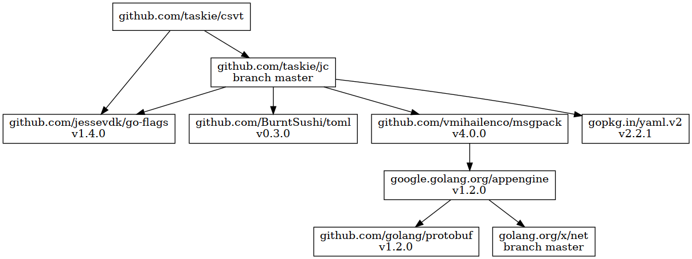

# csvt

transform CSV in various ways

## usage

### convert

```sh
csvt foo.csv foo.json
# or
csvt -t json <foo.csv >foo.json
# or
csvt - foo.json <foo.csv
```

#### foo.csv (input)

```csv
A,B,C
d,e,f
g,h,i
j,k,l
```

#### foo.json (output)

```json
[["A","B","C"],["d","e","f"],["g","h","i"],["j","k","l"]]
```

### convert (reverse)

```sh
csvt foo.json foo.csv
```

### convert (delimiter)

```sh
csvt -d ',' -D '|' foo.csv foo_pipe.csv
```

#### foo_pipe.csv (output)

```
A|B|C
d|e|f
g|h|i
j|k|l
```

### transpose

```sh
csvt -m transpose foo.csv foo_t.csv
```

#### foo_t.csv (output)

```csv
A,d,g,j
B,e,h,k
C,f,i,l
```

### map

```sh
csvt -m map foo.csv foo_map.json
```

#### foo_map.json (output)

```json
[{"A":"d","B":"e","C":"f"},{"A":"g","B":"h","C":"i"},{"A":"j","B":"k","C":"l"}]
```

### unmap

```sh
csvt -m unmap foo_map.json foo.csv
```

## dependency



## license

Apache License 2.0
